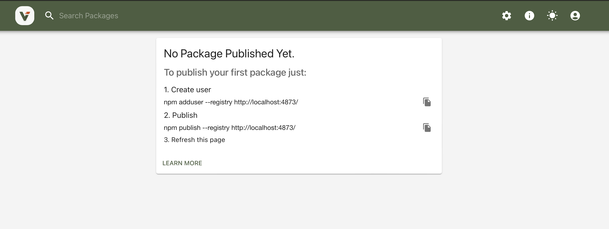
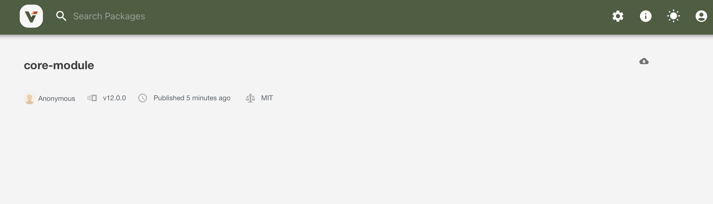
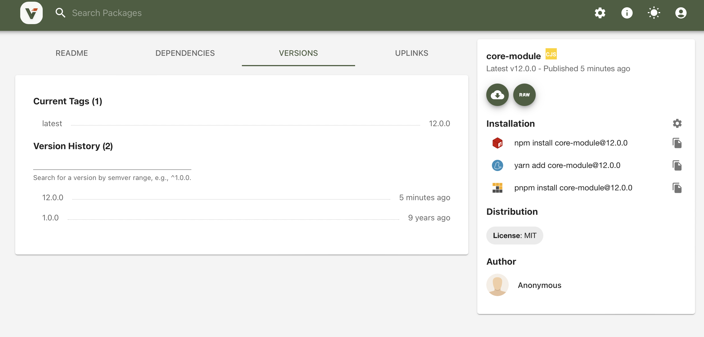

# private-npm-server

verdaccio로 private npm 서버 구축해보기
개인 모듈 업로드 및 설치 후 함수 실행해보기

https://verdaccio.org/

## prviate npm 서버 실행

```
docker-compose up -d
```

## 모듈 생성

1. 모듈 프로젝트 생성

```
mkdir core-module
cd core-module
yarn init
```

2. 모듈 프로젝트 private 서버로 배포

```
npm publish --registry http://localhost:4873/
```

## 모듈 배포 확인







## 모듈 사용

1. app 프로젝트 생성
```
mkdir app
cd app
yarn init
```

2. .yarnrc 파일 추가
```
registry "http://localhost:4873"
```

3. 묘듈 설치

```
yarn add core-module
```

4. 실행해보기

```
node index.js
```